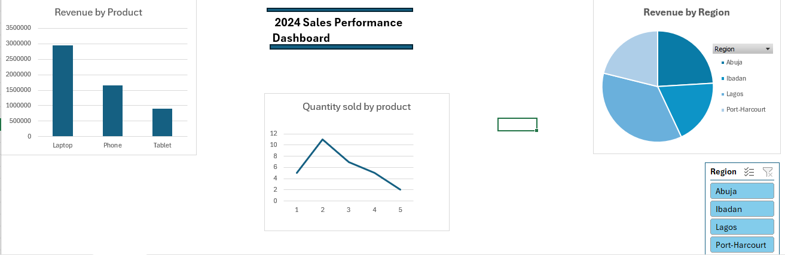

# Sales-Analysis-Excel-File
Interactive Excel Sales Performance Dashboard using Pivot Tables, Pivot Charts, and Slicers.
# 📊 Excel Sales Performance Dashboard

## 📌 Project Overview

This project is an interactive Sales Performance Dashboard built in Microsoft Excel. It analyzes sales data to identify product performance, regional revenue distribution, and overall business performance through charts, pivot tables, and slicers.

The dashboard was created to demonstrate Excel's data analysis and visualization capabilities using PivotTables, PivotCharts, and interactive filters.

---

## 🛠️ Tools Used

- Microsoft Excel
- Pivot Tables
- Pivot Charts
- Slicers
- Data Visualization

---

## 📂 Dataset

The dataset contains sales transaction records with the following fields:

- Date
- Product
- Region
- Revenue
- Quantity

---

## 📈 Dashboard Features

- Revenue by Product (Column Chart)
- Revenue by Region (Pie Chart)
- Interactive Region Slicer
- Sales Performance Dashboard Layout

---

## 📊 Key Insights

- Laptops generated the highest revenue among all products.
- Lagos recorded the largest share of total revenue.
- The dashboard allows users to filter sales performance by region using an interactive slicer.
- Sales information is presented in a simple and interactive format for quick decision-making.

---

## 📷 Dashboard Preview

---

## 📁 Files Included

- Sales_Dashboard.xlsx
- excel-dashboard.png
- README.md

---

## 👩‍💻 Author

**Nkwonta Chimamanda**

Aspiring Data Analyst skilled in:

- Microsoft Excel
- Power BI
- SQL
- Python

Connect with me on LinkedIn and GitHub to see more of my data analytics projects.
